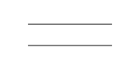
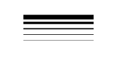
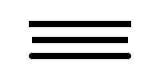

.. _kiva_overview:

Kiva
====

Kiva is a 2D vector drawing interface providing functionality similar to
`Quartz <http://en.wikipedia.org/wiki/Quartz_2D>`_,
`Cairo <http://cairographics.org/>`_, the
`Qt QPainter interface <http://qt-project.org/doc/qt-4.8/qpainter.html>`_,
the 2D drawing routines of `OpenGL <http://www.opengl.org/>`_ , the HTML5
Canvas element and many other similar 2D vector drawing APIs.  Rather than
re-implementing everything, Kiva is a Python interface layer that sits on top
of many different back-ends which are in fact provided by some of these
libraries, depending on the platform, GUI toolkit, and capabilities of the
system.

This approach permits code to be written to the Kiva API, but produce output
that could be rendered to a GUI window, an image file, a PDF file, or a number
of other possible output formats without any (or at least minimal) changes to
the image generation code.

Kiva is the base drawing layer of the Chaco plotting library, and is what is
responsible for actually drawing pixels on the screen.  Developers interested
in writing code that renders new plots or other graphical features for Chaco
will need to be at least passingly familiar with the Kiva drawing API.

The most important Kiva backend is the Agg or "Image" backend, which is a
Python extension module which wraps the C++
`Anti-grain geometry <http://www.antigrain.com/>`_ drawing library into a
Python extension and exposes the Kiva API.  The Agg renders the vector drawing
commands into a raster image which can then be saved as a standard image format
(such as PNG or JPEG) or copied into a GUI window.  The Agg backend should be
available on any platform, and should work even if there is no GUI or windowing
system available.

Kiva Concepts
-------------

This section gives a whirlwind tour of the concepts involved with drawing with
Kiva.

The Graphics Context
~~~~~~~~~~~~~~~~~~~~

The heart of the Kiva drawing API is the "graphics context", frequently
abbreviated as ``gc`` in code.  The graphics context holds the current drawing
state (such as pen and fill colors, font state, and affine transformations to
be applied to points) and provides methods for changing the state and
performing drawing actions.

In many common use-cases (such as writing renderers for Chaco), you will be
provided a graphics context by other code, but it is straight-forward to create
your own graphics context::

    from kiva.image import GraphicsContext

    gc = GraphicsContext((400, 400))

This is an graphics context for the Agg or "image" backend which has a size of
400x400 pixels.  If instead we wanted to draw into a Qt ``QPainter`` drawing
context in a `QWidget` called `my_qwidget` we would use::

    from kiva.qpainter import GraphicsContext

    gc = GraphicsContext((400, 400), parent=my_qwidget)

Other Kiva backends have similar methods of creating a graphics context, and
each may take somewhat different arguments to the constructor, depending on the
requirements of the backend.

Once you have a graphics context, you can use it to draw vector graphics.
For example, the following code will draw a translucent gray line from
(100, 100) to (100, 200)::

    gc.move_to(100, 100)
    gc.line_to(100, 200)
    gc.set_stroke_color((0.5, 0.5, 0.5, 0.5))
    gc.stroke_path()

For many of the backends, you can save the rendered image out as an image file
using the ``save()`` method::

    gc.save("my_line.png")

Kiva is numpy-aware, and has a number of methods that allow you to pass numpy
arrays of points to draw many things in one operation, with loops being
performed in C where possible::

    from numpy import empty, linspace, random

    # Nx2 array of points
    pts = empty(shape=(20, 2), dtype=float)
    pts[:, 0] = linspace(100, 200, 20)
    pts[:, 1] = random.uniform(size=20)*100 + 100

    gc.lines(pts)
    gc.stroke_path()

Coordinate Model
~~~~~~~~~~~~~~~~

Kiva uses mathematical axes direction conventions as opposed to framebuffer
axes conventions.  In other words, the origin is always at the *bottom*
left of the screen, and the positive y axis goes *up* from bottom to top; as
opposed to screen coordinates which typically have the origin at the *top* left
and the positive y axis goes *down* from top to bottom.

Additionally, for backends that produce raster images, the coordinates
represent the *corner* of pixels, rather than the center of pixels.  This has
consequences when rendering thin lines.  Compare the two lines in this example,
for instance::

    from kiva.image import GraphicsContext

    gc = GraphicsContext((200, 100))

    gc.move_to(40, 35)
    gc.line_to(160, 35)

    gc.move_to(40, 65.5)
    gc.line_to(160, 65.5)

    gc.set_stroke_color((0.0, 0.0, 0.0))
    gc.stroke_path()

    gc.save("pixel_coordinates.png")

Notice that the line on the bottom (the first of the two lines) is fuzzier
because it is drawn along the boundary of the pixels, while the other line
is drawn through the center of the pixels:

The Coordinate Transform Matrix
~~~~~~~~~~~~~~~~~~~~~~~~~~~~~~~

The Kiva API allows arbitrary affine transforms to be applied to the graphics
context during drawing.  The API provides convenience methods for common
transformations, such as rotation and scaling::

    from numpy import empty, linspace, random, pi
    from kiva.image import GraphicsContext

    # Nx2 array of points
    pts = empty(shape=(20, 2), dtype=float)
    pts[:, 0] = linspace(100, 200, 20)
    pts[:, 1] = random.uniform(size=20)*100 + 100

    gc = GraphicsContext((400, 400))

    # draw a simple graph
    gc.move_to(100, 200)
    gc.line_to(100, 100)
    gc.line_to(200, 100)
    gc.set_stroke_color((0.5, 0.5, 0.5, 0.5))
    gc.stroke_path()

    gc.lines(pts)
    gc.set_stroke_color((1.0, 0.0, 0.0, 0.5))
    gc.stroke_path()

    # translate by 100 pixels in the x direction
    gc.translate_ctm(100, 0)

    # rotate by 45 degrees
    gc.rotate_ctm(pi/4.0)

    # scale by 1.5 in the x direction
    gc.scale_ctm(1.5, 1.0)

    # now draw in the transformed coordinates
    gc.move_to(100, 200)
    gc.line_to(100, 100)
    gc.line_to(200, 100)
    gc.set_stroke_color((0.5, 0.5, 0.5, 0.5))
    gc.stroke_path()

    gc.lines(pts)
    gc.set_stroke_color((0.0, 0.0, 1.0, 0.5))
    gc.stroke_path()

    gc.save('transformed_lines.png')

.. image:: images/transformed_lines.png

If desired, the user can also supply their own transformations directly.

Paths
-----

The basic drawing operations are performed by building a path out of primitive
operations, and then performing stroking and/or filling operations with it.

The simplest path operations are ``move_to()`` and ``line_to()`` which
respectively move the current point in the path to the specified point, and
add a line to the path from the current point to the specified point.

In addition to the straight line commands, there are 4 arc commands for adding
curves to a path: ``curve_to()`` which draws a cubic bezier curve,
``quad_curve_to()`` which draws a quadratic bezier curve, ``arc()`` which
draws a circular arc based on a center and radius, and ``arc_to()`` which
draws a circular arc from one point to another.

Finally, the ``rect()`` method adds a rectangle to the path.

In addition there are convenience methods ``lines()``, ``rects()`` and
``line_set()`` which add multiple lines or rectangles to a path, reading from
appropriately shaped numpy arrays.

None of these methods make any change to the visible image until the path is
either stroked with ``stroke_path()`` or filled with ``fill_path()``.  The way
these actions are performed depends upon certain state of the graphics context.

For stroking, the graphics context keeps track of the color to use with
``set_stroke_color()``, the thickness of the line with ``set_line_width()``,
the way that lines are joined with ``set_line_join()`` and
``set_miter_limit()``, and the way that they are ended with ``set_line_cap()``.
Lines can also be dashed using the ``set_line_dash()`` method which takes a
pattern of numbers to use for lengths of on and off, and an optional ``phase``
for where to start in the pattern.

Thicknesses::

    from kiva.image import GraphicsContext

    gc = GraphicsContext((200, 100))

    for i in range(5):
        y = 30.5 + i*10
        thickness = 2.0**(i-1)

        gc.move_to(40, y)
        gc.line_to(160, y)
        gc.set_line_width(thickness)
        gc.stroke_path()

    gc.save('thicknesses.png')

Joins::

    from kiva.api import JOIN_ROUND, JOIN_BEVEL, JOIN_MITER
    from kiva.image import GraphicsContext

    gc = GraphicsContext((200, 100))
    gc.set_line_width(8)

    for i, join in enumerate([JOIN_ROUND, JOIN_BEVEL, JOIN_MITER]):
        y = 20 + i*20

        gc.move_to(y, 80)
        gc.line_to(y, y)
        gc.line_to(160, y)
        gc.set_line_join(join)
        gc.stroke_path()

    gc.save('joins.png')

.. image:: images/joins.png

Caps::

    from kiva.api import CAP_ROUND, CAP_BUTT, CAP_SQUARE
    from kiva.image import GraphicsContext

    gc = GraphicsContext((200, 100))
    gc.set_line_width(8)

    for i, cap in enumerate([CAP_ROUND, CAP_BUTT, CAP_SQUARE]):
        y = 30 + i*20

        gc.move_to(40, y)
        gc.line_to(160, y)
        gc.set_line_cap(cap)
        gc.stroke_path()

    gc.save('caps.png')

Dashes::

    from kiva.image import GraphicsContext

    gc = GraphicsContext((200, 100))
    dashes = ([6.0, 6.0], [9.0, 3.0], [3.0, 5.0, 9.0, 5.0])
    gc.set_line_width(2)

    for i, dash in enumerate(dashes):
        y = 30.5 + i*20

        gc.move_to(40, y)
        gc.line_to(160, y)
        gc.set_line_dash(dash)
        gc.stroke_path()

    gc.save('dashes.png')

.. image:: images/dashes.png

Before filling a path, the colour of the fill is via the ``set_fill_color()``
method, and gradient fills can be done via the ``set_linear_gradient()`` and
``set_radial_gradient()`` methods.  Finally, there are two different fill modes
available:
`even-odd fill <http://en.wikipedia.org/wiki/Even%E2%80%93odd_rule>`_ and
`non-zero winding fill <http://en.wikipedia.org/wiki/Nonzero-rule>`_

Winding vs. Even-Odd Fill::

    from numpy import pi
    from kiva.api import FILL, EOF_FILL
    from kiva.image import GraphicsContext

    gc = GraphicsContext((200, 100))
    gc.set_fill_color((0.0, 0.0, 0.0))

    gc.move_to(50, 90)
    for i in range(1, 6):
        theta = 4*pi/5*i
        x = 50+40*sin(theta)
        y = 50+40*cos(theta)
        gc.line_to(x, y)

    gc.fill_path()

    gc.move_to(150, 90)
    for i in range(1, 6):
        theta = 4*pi/5*i
        x = 150+40*sin(theta)
        y = 50+40*cos(theta)
        gc.line_to(x, y)

    gc.eof_fill_path()

    gc.save('fill.png')

.. image:: images/fill.png

Text
~~~~

Text can be rendered at a point by first setting the font to use, then setting
the text location using ``set_text_position()`` and then ``show_text()`` to
render the text::

    from kiva.api import Font
    from kiva.image import GraphicsContext

    gc = GraphicsContext((200, 100))

    gc.set_font(Font(size=24))
    gc.set_text_position(30, 40)
    gc.show_text("Hello World")

    gc.save('text.png')

.. image:: images/text.png

Text defaults to being rendered filled, but can be rendered with an outline.
