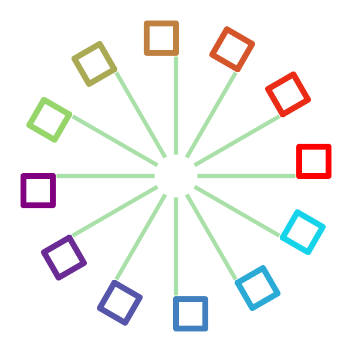

Kiva State
==========
Kiva is a "stateful" drawing API. What this means is that the graphics context
has a collection of state which affects the results of its drawing actions.
Furthermore, Kiva enables this state to be managed with a stack such that state
can be "pushed" onto the stack before making some temporary changes and then
"popped" off the stack to restore the state to a version which no longer
includes those changes.

State Components
----------------
Here is a list of all the pieces of state tracked by a Kiva graphics context,
along with the methods which operate on them:

* Affine transformation (:py:meth:`translate_ctm`, :py:meth:`rotate_ctm`,
  :py:meth:`scale_ctm`, :py:meth:`concat_ctm`, :py:meth:`set_ctm`,
  :py:meth:`get_ctm`)
* Clipping (:py:meth:`clip_to_rect`, :py:meth:`clip_to_rects`, :py:meth:`clip`,
  :py:meth:`even_odd_clip`)
* Fill color (:py:meth:`set_fill_color`, :py:meth:`get_fill_color`,
  :py:meth:`linear_gradient`, :py:meth:`radial_gradient`)
* Stroke color (:py:meth:`set_stroke_color`, :py:meth:`get_stroke_color`)
* Line width (:py:meth:`set_line_width`)
* Line join style (:py:meth:`set_line_join`)
* Line cap style (:py:meth:`set_line_cap`)
* Line dashing (:py:meth:`set_line_dash`)
* Global transparency (:py:meth:`set_alpha`, :py:meth:`get_alpha`)
* Anti-aliasing (:py:meth:`set_antialias`, :py:meth:`get_antialias`)
* Miter limit (:py:meth:`set_miter_limit`)
* Flatness (:py:meth:`set_flatness`)
* Image interpolation (:py:meth:`set_image_interpolation`, :py:meth:`get_image_interpolation`)
* Text drawing mode (:py:meth:`set_text_drawing_mode`)

Color
-----
Kiva has two colors in its graphics state: stroke color and fill color. Stroke
color is used for the lines in paths when the drawing mode is ``STROKE``,
``FILL_STROKE`` or ``EOF_FILL_STROKE``. Fill color is used for text and for
the enclosed sections of paths when the drawing mode is ``FILL``, ``EOF_FILL``,
``FILL_STROKE``, or ``EOF_FILL_STROKE``. Additionally, the fill color can be
set by the :py:meth:`linear_gradient` and :py:meth:`radial_gradient` methods.

.. note::
   Even though text uses the fill color, text will not be filled with a
   gradient *unless* the text drawing mode is ``TEXT_FILL_STROKE`` and even that
   will only work if the backend supports it.

Color values should always be passed in as 3- or 4- tuples. The order of the
color components is ``(R, G, B[, A])`` and values must be floating point numbers
in the range [0, 1]. Even if a graphics context is not able to draw with alpha
blending, it's still OK to pass a 4 component color value when setting state.

State Stack Management
----------------------
Graphics context instances have two methods for saving and restoring the state,
:py:meth:`save_state` ("push") and :py:meth:`restore_state` ("pop"). That said,
it isn't recommended practice to call the methods directly. Instead, you can
treat the graphics context object as a
`context manager <https://docs.python.org/3/library/stdtypes.html#typecontextmanager>`_
and use the ``with`` keyword to create a block of code where the graphics state
is temporarily modified. Using the context manager approach provides safety from
"temporary" modifications becoming permanent if an uncaught exception is raised
while drawing.

In Enable and Chaco, it is frequently the case that a graphics context instance
will be passed into a method for the purpose of some drawing. Because it is not
reasonable to push the responsibility of state management "up" the call stack,
the onus is on the code making state modifications to do them safely so that
other changes don't leak into other code.

**Well behaved code should take care to only modify graphics state inside a**
``with`` **block**.

Example
-------

First, the whole example:

.. literalinclude:: state_ex.py
  :linenos:

The first part sets up the default graphics state. Here, that includes a scale
of 2 in X and Y, a translation of (150, 150) which is affected by the
preceeding scale transformation, and some line properties: stroke color, width,
join, and cap:

.. literalinclude:: state_ex.py
  :lines: 7-13
  :linenos:
  :lineno-match:

Then in a loop, we draw twice (the two :py:meth:`stroke_path` calls). The first
draw uses a ``with`` block to temporarily modify the drawing state. It adds more
affine transformations: a rotate and a translate. It also changes some line
properties: stroke color, width, and cap. A rectangle is then added to the 
current path and stroked.

.. literalinclude:: state_ex.py
  :lines: 17-24
  :linenos:
  :lineno-match:

After leaving the first ``with`` block, the state is now restored to its
default. A new ``with`` block is entered and the current transformation matrix
is modified with the same rotation as the first drawing block, but a
*different* translation is applied. The line properties are unchanged
and so use the defaults set at the top.

.. literalinclude:: state_ex.py
  :lines: 26-31
  :linenos:
  :lineno-match:
