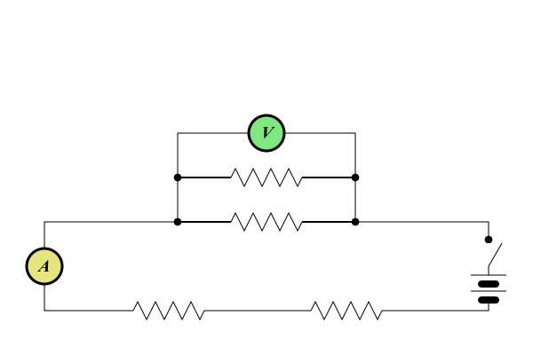
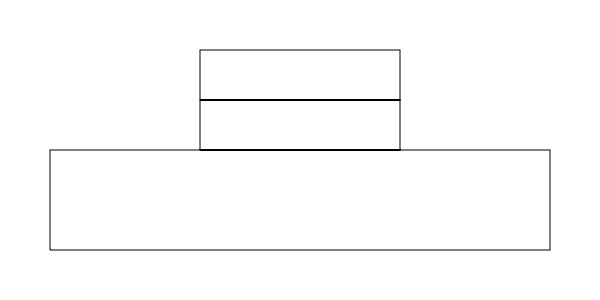
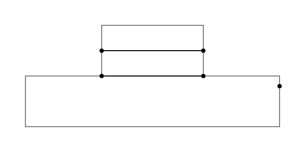
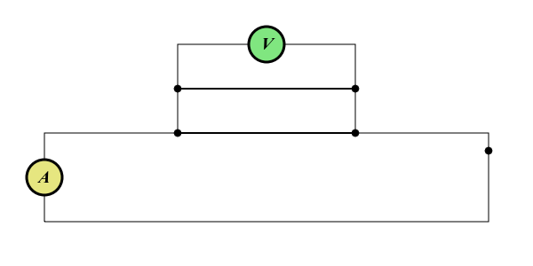
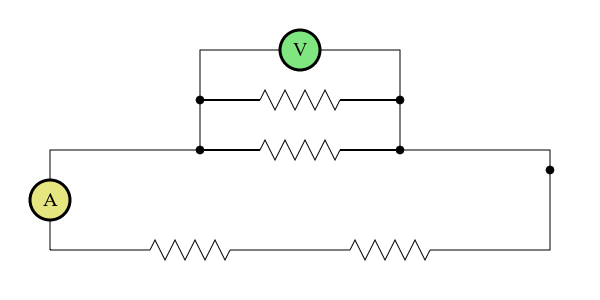
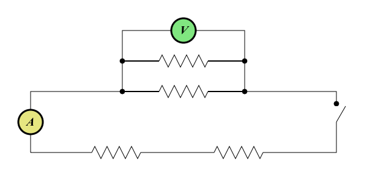

Introduction
============

This tutorial is intended to help you get up and running working with kiva.
Kiva is a backend agnostic 2D vector drawing interface.  In other words, it is
a Python interface layer which sits on top of many different backends which
provide 2D vector drawing functionality such as Quartz, Cairo, etc.  Many of
the concepts that will be covered here are generalizations of the ideas that
govern the underlying backends.  As such, new kiva users may find it useful for
their general understanding of what kiva is all about to go through any of the
numerous other tutorials / documentation out there for specific backends. Here
are some we recommend: 

- `Quartz <https://developer.apple.com/library/archive/documentation/GraphicsImaging/Conceptual/drawingwithquartz2d/Introduction/Introduction.html>`_
- `HTML5 canvas <https://developer.mozilla.org/en-US/docs/Web/API/Canvas_API/Tutorial>`_

Before we dive in, we suggest at least skimming the kiva documentation before
going through the tutorial so you are familiar with the major terms and
concepts.

Circuit Diagram Example
=======================

In this tutorial, we will go through the process of drawing the basic circuit
diagram shown below step by step, with kiva.  As mentioned, kiva supports a
variety of different backends, but for this tutorial we will work with the
default agg backend.

Starting from the beginning, we will need a GraphicsContext so we import it
from our desired backend and instantiate it.  Disregard the other imports for
now, they will come into play later in the tutorial.

.. literalinclude:: tutorial.py
    :lines: 1-8

Now we are ready to use it to start drawing - simple as that.  Lets start with
just drawing the wires.  Given that they are rectangles, this can be done
quite easily using the graphics context's `rect` method.

.. literalinclude:: tutorial.py
    :lines: 10-14

That was easy. Now, let's draw the dots indicating wire connections. To do
this, we can use the optimized :py:meth:`draw_marker_at_points` method.
In this case, with only 5 dots to draw, the speed up is likely negligible.
However, in scenarios where you need to draw many markers this method can
provide a significant boost as opposed to just using a for loop.  Here we
simply define the points of the markers and call the method with the points, a
marker size, and a marker (the `CIRCLE_MARKER` we imported from `kiva.api`)
passed as arguments.

.. literalinclude:: tutorial.py
    :lines: 17-25

Next, we will draw the Ammeter and Voltmeter symbols. To do this, we are going
to want to modify the graphics context's state to transform our coordinate
system to draw in the correct locations, and also to change things like the
fill color, line width, etc.  However, we only want these state modifications
to apply to this specific part of the drawing. Luckily, to manage this, the
graphics context object can actually be uesd as a python
`context manager <https://docs.python.org/3/library/stdtypes.html#typecontextmanager>`_.
This allows us to meddle with state temporarily, do some drawing, and then have
the state reset to where it was once we are finished.

In the following code, we instantiate a :class:`Font` object and set it to be
the graphics context's font.  We do this first as it is the only font we intend
to use, so it can be a persistent modification to state. Then, we use two
``with`` blocks to temporarily modify state. In each, we move to the desired
location to draw the symbol, change fill color, define a circular path with the
:py:meth:`arc` method, adjust the line width, and then finally draw our path.
Once the path is drawn, we draw the text inside. To do this we first set the
fill color back to black. Next, we ensure the font is centered in the circular
path. We do this be calling :py:meth:`get_text_extent` to determine the width
and height that the text takes up. When we call :py:meth:`show_text_at_point`,
the arguments specifying the point to draw at represent the lower left corner
of the resulting text.  Thus, since the origin of our coordinate system is
currently at the center of the circle, in order for the text to be centered we
need to draw the text at (-w/2, -h/2).

.. literalinclude:: tutorial.py
    :lines: 28-51

As you may have noticed, most of the code for drawing the Ammeter and the
Voltmeter was effectively the same.  Sometimes it is useful to work with an
independent path instance as opposed to specifically messing with the current
path of the graphics context. This brings us to the notion of CompiledPaths,
which we will now use to draw the resistors. As you can see the path for each
resistor will be exactly the same. Rather than moving our coordinate system
around to each location and redrawing the same path at each location, we will
instead define the path using a CompiledPath and draw at each of the various
desired locations using the `draw_path_at_points` method. To do this we
instantiate a :class:`CompiledPath`, and then define our path just as we would with
the graphics context's current path. The interface uses the same
:ref:`kiva_path_functions`. Finally, we can simply call
:py:meth:`draw_path_at_points` passing in the locations we want to draw the
path, our compiled path, and the drawing mode.

.. literalinclude:: tutorial.py
    :lines: 70-77

If you run just this code, you will notice that things don't look quite right,
as the original lines for the wires still show underneath our resistors. We can
get rid of these by drawing white lines over the relevant portions of the wire
before we call the above code.  Explicitly, we can run 

.. literalinclude:: tutorial.py
    :lines: 54-68

Now, for the switch. Just like above, we are going to want to "remove" the
previously drawn wire. Then, for the actual switch, we want to effectively just
rotate that segment of wire outwards. To do we tranform our coordinates so that
we can simply draw a line along the x axis of the same length as the gap we
just created. Thus, we translate to the lower edge of the switch, and rotate
our axis to our desired angle. The beauty of the context manager then reverts
our coordinate system back to as it was before.

.. literalinclude:: tutorial.py
    :lines: 80-98

We will leave the drawing of the battery as an exercise for the reader, but the
full code for the example is available :download:`here <../tutorial.py>`.
